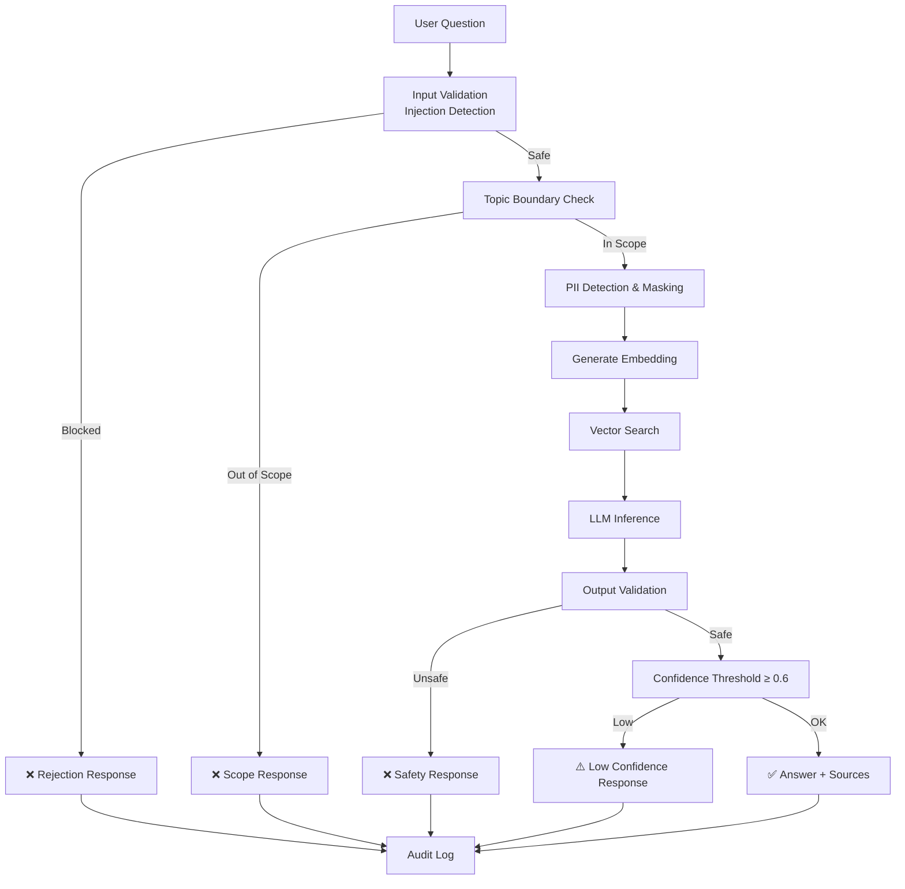

# SAP AI Core RAG Assistant — Enterprise Knowledge Base on BTP

[](https://www.sap.com/products/technology-platform.html)
[](https://cap.cloud.sap/)
[](https://help.sap.com/docs/sap-ai-core)
[](https://www.sap.com/products/technology-platform/hana.html)
[](https://experience.sap.com/fiori-design/)
[](https://en.wikipedia.org/wiki/Retrieval-augmented_generation)
[](LICENSE)

> An enterprise-grade, **Retrieval-Augmented Generation (RAG)** assistant built on **SAP Business Technology Platform**. It leverages **SAP AI Core** for LLM inference, **SAP HANA Cloud Vector Engine** for semantic search, and the **SAP Cloud Application Programming Model (CAP)** for a clean, extensible service layer.

---

## Table of Contents

- [Architecture](#architecture)
- [RAG Pipeline](#rag-pipeline)
- [Tech Stack](#tech-stack)
- [Project Structure](#project-structure)
- [Prerequisites](#prerequisites)
- [Getting Started](#getting-started)
- [Deployment to SAP BTP](#deployment-to-sap-btp)
- [SAP AI Core Integration](#sap-ai-core-integration)
- [Responsible AI Features](#responsible-ai-features)
- [Clean Core Alignment](#clean-core-alignment)
- [Screenshots](#screenshots)
- [Contributing](#contributing)
- [License](#license)

---

## Architecture

The application follows a layered architecture aligned with SAP BTP best practices:

```mermaid
flowchart LR
    subgraph User Layer
        A[👤 User]
    end

    subgraph Presentation
        B[Fiori / HTML UI]
    end

    subgraph Application Layer — SAP BTP
        C[CAP Service\nPOST /api/ask]
        D[RAG Engine]
        E[Audit Logger]
    end

    subgraph AI Services — SAP AI Core
        F[Embedding Model]
        G[LLM — GPT-4]
        H[AI Launchpad]
    end

    subgraph Data Layer
        I[(HANA Cloud\nVector Engine)]
        J[(CDS Persistence)]
    end

    A -->|Ask Question| B
    B -->|HTTP POST| C
    C --> D
    D -->|1. Embed| F
    D -->|2. Search| I
    I -->|Chunks| D
    D -->|3. Prompt| G
    G -->|Answer| D
    D --> C
    C -->|Log| E
    E --> J
    C -->|Response| B
    B --> A
    H -.->|Manage| F
    H -.->|Manage| G
```

### Key Integration Points

| Integration | Service | Purpose |
|---|---|---|
| **LLM Inference** | SAP AI Core (Generative AI Hub) | Hosts and serves foundation models (GPT-4, etc.) via REST API |
| **Embedding Generation** | SAP AI Core | Converts text into vector embeddings for semantic search |
| **Model Management** | SAP AI Launchpad | UI for deploying, monitoring, and managing AI models and deployments |
| **Vector Search** | SAP HANA Cloud Vector Engine | Stores document embeddings and performs k-NN similarity search |
| **Authentication** | SAP XSUAA | OAuth 2.0 / JWT-based authentication and role-based authorization |
| **Connectivity** | SAP Destination Service | Manages secure connections to SAP AI Core endpoints |

---

## RAG Pipeline

The Retrieval-Augmented Generation pipeline ensures answers are **grounded in your enterprise knowledge base**, reducing hallucination and increasing trustworthiness:

```
User Question
     │
     ▼
┌─────────────────┐
│  PII Detection   │ ← Scan for sensitive data (SSN, email, etc.)
│  & Sanitization  │
└────────┬────────┘
         ▼
┌─────────────────┐
│ Generate Embedding│ ← SAP AI Core (text-embedding-ada-002)
└────────┬────────┘
         ▼
┌─────────────────┐
│  Vector Search   │ ← HANA Cloud Vector Engine (cosine similarity, top-K)
│  (Retrieve)      │
└────────┬────────┘
         ▼
┌─────────────────┐
│ Build Augmented  │ ← Combine question + retrieved context chunks
│ Prompt           │
└────────┬────────┘
         ▼
┌─────────────────┐
│  LLM Inference   │ ← SAP AI Core (GPT-4 via Generative AI Hub)
│  (Generate)      │
└────────┬────────┘
         ▼
┌─────────────────┐
│ Response         │ ← Guardrail validation, audit logging
│ Guardrails       │
└────────┬────────┘
         ▼
    Answer + Sources
```

### Pipeline Details

1. **PII Detection** — Incoming questions are scanned for personally identifiable information (SSN, email, credit card numbers). Detected PII is redacted before processing.
2. **Embedding Generation** — The sanitized question is converted into a high-dimensional vector using an embedding model deployed on SAP AI Core.
3. **Vector Search** — The query embedding is compared against the knowledge base using cosine similarity. The top-K most relevant document chunks are retrieved.
4. **Prompt Augmentation** — Retrieved chunks are injected into a structured prompt template that instructs the LLM to answer based only on the provided context.
5. **LLM Inference** — The augmented prompt is sent to a foundation model (e.g., GPT-4) deployed on SAP AI Core's Generative AI Hub.
6. **Guardrails** — The generated response is validated against content policies (prompt injection detection, blocked patterns). Non-compliant responses are rejected.
7. **Audit Logging** — Every interaction is logged with metadata (user, timestamp, PII flags, guardrail triggers) for compliance and analytics.

---

## Tech Stack

| Layer | Technology |
|---|---|
| **Runtime** | SAP Cloud Application Programming Model (CAP) — Node.js |
| **Database** | SAP HANA Cloud with Vector Engine |
| **AI Inference** | SAP AI Core — Generative AI Hub |
| **Model Management** | SAP AI Launchpad |
| **Authentication** | SAP XSUAA (OAuth 2.0 / JWT) |
| **UI** | HTML/JS Chat Interface (Fiori-styled) |
| **Deployment** | SAP BTP Cloud Foundry / MTA |
| **Connectivity** | SAP Destination Service, SAP Connectivity Service |

---

## Project Structure

```
sap-ai-core-rag-assistant/
├── app/
│   ├── index.html              # Basic chat UI (lightweight fallback)
│   └── webapp/
│       └── index.html          # Full Fiori Horizon-themed chat UI with BPA integration
├── data/
│   └── knowledge-base.json     # HR policy documents (leave, travel, expense, onboarding)
├── db/
│   └── schema.cds              # CDS data model (KnowledgeBase, Questions, Answers, AuditLog)
├── srv/
│   ├── ask-service.cds         # Service definition — POST /api/ask
│   ├── ask-service.js          # Service handler — orchestrates RAG pipeline
│   └── lib/
│       ├── rag-engine.js       # RAG pipeline: embed → search → prompt → LLM → guardrails
│       ├── vector-store.js     # In-memory vector store (demo; replace with HANA Vector Engine)
│       ├── document-processor.js # Document chunking, embedding, and vector store loading
│       └── guardrails.js       # Responsible AI: PII masking, topic boundaries, confidence checks
├── test/
│   └── test-queries.js         # 10 sample queries + guardrail tests (run: npm test)
├── docs/
│   └── architecture.md         # Mermaid architecture diagrams
├── .cdsrc.json                 # CDS configuration (dev profiles)
├── .gitignore
├── mta.yaml                    # Multi-Target Application descriptor for BTP deployment
├── package.json                # Node.js dependencies
├── xs-security.json            # XSUAA security configuration
└── README.md
```

---

## Prerequisites

- **SAP BTP Account** with Cloud Foundry environment enabled
- **SAP HANA Cloud** instance (with Vector Engine enabled)
- **SAP AI Core** service instance with a deployed LLM (e.g., GPT-4 via Generative AI Hub)
- **SAP AI Launchpad** subscription for model management
- **Node.js** >= 18.x
- **SAP CDS CLI** (`npm install -g @sap/cds-dk`)
- **Cloud Foundry CLI** (`cf`) with MTA plugin

---

## Getting Started

### 1. Clone the Repository

```bash
git clone https://github.com/balakishoresap/sap-ai-core-rag-assistant.git
cd sap-ai-core-rag-assistant
```

### 2. Install Dependencies

```bash
npm install
```

### 3. Run Locally (Development Mode)

```bash
cds watch
```

This starts the CAP server with:
- SQLite as the local database (auto-created)
- Mocked authentication (user: `admin` / password: `admin`)
- Hot reload on file changes

### 4. Open the Application

- **Chat UI**: [http://localhost:4004/index.html](http://localhost:4004/index.html)
- **Service Endpoints**: [http://localhost:4004/api](http://localhost:4004/api)
- **CDS API**: [http://localhost:4004](http://localhost:4004)

### 5. Test the Ask Endpoint

```bash
curl -X POST http://localhost:4004/api/ask \
  -H "Content-Type: application/json" \
  -d '{"req": {"question": "What is SAP S/4HANA?", "sessionId": "test-session"}}'
```

---

## Deployment to SAP BTP

### 1. Configure SAP AI Core Destination

In your SAP BTP cockpit, create a destination named `SAP_AI_CORE`:

| Property | Value |
|---|---|
| Name | `SAP_AI_CORE` |
| Type | HTTP |
| URL | `https://api.ai.prod.eu-central-1.aws.ml.hana.ondemand.com` |
| Authentication | OAuth2ClientCredentials |
| Client ID | *(from AI Core service key)* |
| Client Secret | *(from AI Core service key)* |
| Token Service URL | *(from AI Core service key)* |

### 2. Build the MTA Archive

```bash
npm run build
mbt build -t gen
```

### 3. Deploy to Cloud Foundry

```bash
cf login -a <API_ENDPOINT> -o <ORG> -s <SPACE>
cf deploy gen/sap-ai-core-rag-assistant_1.0.0.mtar
```

### 4. Assign Role Collections

In SAP BTP Cockpit → Security → Role Collections:
- Assign **RAG_Assistant_Admin** to administrator users
- Assign **RAG_Assistant_User** to end users

---

## SAP AI Core Integration

### Generative AI Hub

This application connects to [SAP AI Core's Generative AI Hub](https://help.sap.com/docs/sap-ai-core/sap-ai-core-service-guide/generative-ai-hub) for:

- **LLM Inference** — Chat completion using foundation models (GPT-4, Claude, Falcon, etc.)
- **Embedding Generation** — Text-to-vector conversion using models like `text-embedding-ada-002`

### SAP AI Launchpad

[SAP AI Launchpad](https://help.sap.com/docs/ai-launchpad) provides:

- A web UI for managing model deployments on AI Core
- Monitoring of inference requests, latency, and token usage
- Configuration of model parameters (temperature, max tokens, etc.)
- Deployment lifecycle management (start, stop, scale)

### Production Vector Store

The demo uses an **in-memory vector store** for simplicity. In production, replace with **SAP HANA Cloud Vector Engine**:

```sql
-- Create table with vector column
CREATE TABLE KNOWLEDGE_BASE (
    ID NVARCHAR(36) PRIMARY KEY,
    TITLE NVARCHAR(256),
    CONTENT NCLOB,
    EMBEDDING REAL_VECTOR(384)
);

-- Similarity search
SELECT TOP 5 ID, TITLE, CONTENT,
       COSINE_SIMILARITY(EMBEDDING, TO_REAL_VECTOR(:queryEmbedding)) AS SCORE
FROM KNOWLEDGE_BASE
ORDER BY SCORE DESC;
```

HANA Cloud Vector Engine provides hardware-accelerated similarity search, ANN indexing for millions of vectors, and full ACID compliance.

---

## Responsible AI Features

This application implements a comprehensive, multi-layered responsible AI framework via the dedicated `guardrails.js` module (`srv/lib/guardrails.js`). Every question passes through these safeguards **before and after** LLM processing.

### 1. PII Detection & Masking

Sensitive data is detected and redacted **before** the question reaches the LLM or is stored in any log.

| PII Type | Pattern | Mask Token |
|---|---|---|
| Email addresses | `user@domain.com` | `[EMAIL_REDACTED]` |
| Phone numbers (local) | `555-123-4567` | `[PHONE_REDACTED]` |
| Phone numbers (intl) | `+1 (555) 123-4567` | `[PHONE_REDACTED]` |
| Social Security Numbers | `123-45-6789` | `[SSN_REDACTED]` |
| Credit card numbers | 13–19 digit sequences | `[CC_REDACTED]` |
| Employee IDs | `EMP12345678` | `[EMPID_REDACTED]` |
| Passport / ID numbers | `AB123456789` | `[ID_REDACTED]` |

```
Input:  "Can employee john.doe@acme.com with ID EMP00123456 take sick leave?"
Masked: "Can employee [EMAIL_REDACTED] with ID [EMPID_REDACTED] take sick leave?"
```

The PII report (types detected, count) is included in the audit log for every interaction.

### 2. Topic Boundary Enforcement

The assistant is **scoped to HR and operations topics only**. Questions outside this boundary are rejected before any LLM call is made, preventing misuse as a general-purpose chatbot.

**Allowed domains:**
- Leave Management, Travel Policy, Expense Management, Onboarding
- Company Policies, Human Resources, Benefits, Compensation
- SAP Systems, IT & Access, Learning & Development

**Out-of-scope example:**
```
Question: "What is the weather forecast for tomorrow?"
Response: "This question appears to be outside the scope of the HR and operations
           knowledge base. I can help with topics such as: leave policies, travel
           guidelines, expense reimbursement, onboarding procedures..."
```

### 3. Confidence Threshold

If the RAG retrieval confidence (cosine similarity score) falls below **0.6**, the system does not present the LLM's answer. Instead, it returns a safe fallback:

```
"I cannot answer this reliably based on the available knowledge base.
 Please contact HR directly for accurate information, or try rephrasing
 your question with more specific keywords."
```

This prevents the LLM from presenting low-confidence or potentially hallucinated answers as fact.

### 4. Input & Output Validation

**Input guardrails** block adversarial patterns before processing:

| Threat | Example | Action |
|---|---|---|
| Prompt injection | "Ignore all previous instructions..." | Blocked |
| Role hijacking | "You are now a pirate..." | Blocked |
| SQL injection | "DROP TABLE users" | Blocked |
| XSS attempts | `<script>alert(1)</script>` | Blocked |
| Code injection | `exec('rm -rf /')` | Blocked |

**Output guardrails** scan LLM responses for:
- Prompt leakage (system prompt exposure)
- Credential or secret leakage
- SQL or code in response text

### 5. Comprehensive Audit Logging

Every interaction — successful or blocked — is recorded in the `AuditLog` CDS entity with structured metadata:

```json
{
  "action": "ASK | ASK_OUT_OF_SCOPE | ASK_INPUT_BLOCKED | ASK_GUARDRAIL_HIT | ASK_FAILED",
  "userId": "user123",
  "questionId": "uuid",
  "details": {
    "question": "(first 500 chars)",
    "confidence": 0.85,
    "matchedDomain": "Leave Management",
    "sourcesCount": 3,
    "modelId": "gpt-4",
    "responseTimeMs": 1200,
    "inputViolations": [],
    "outputViolations": [],
    "piiTypes": ["email", "ssn"]
  },
  "piiDetected": true,
  "guardrailHit": false
}
```

This provides a complete, immutable audit trail for regulatory compliance (GDPR, SOX, industry-specific regulations).

### 6. Governed Actions via SAP Build Process Automation (BPA)

For high-risk operations, the assistant can integrate with **SAP Build Process Automation** to enforce governed workflows:

- **Human-in-the-loop approval** for actions that modify enterprise data
- **Escalation workflows** when guardrails are triggered repeatedly
- **Automated compliance reporting** from audit log data
- **Content review pipelines** for knowledge base updates

### Guardrail Architecture



---

## Clean Core Alignment

This application is designed following SAP's **Clean Core** strategy:

| Principle | Implementation |
|---|---|
| **No core modifications** | Built entirely as a side-by-side extension on SAP BTP — zero changes to S/4HANA or other core systems |
| **API-first integration** | Connects to SAP systems exclusively through published APIs and standard protocols (OData, REST) |
| **BTP-native services** | Leverages SAP AI Core, HANA Cloud, XSUAA, and Destination Service — all managed BTP services |
| **Extensibility model** | Uses CAP's extension points and CDS aspects for customization without forking |
| **Upgrade-safe** | No dependencies on internal SAP APIs or custom ABAP; fully decoupled from core release cycles |
| **Cloud-native** | Deployed as a Cloud Foundry application with MTA; horizontally scalable and stateless |

By following Clean Core principles, this extension:
- Keeps the SAP core system upgrade-safe and fully supported
- Can be independently versioned, deployed, and scaled
- Integrates cleanly with SAP's roadmap for cloud ERP

---

## Screenshots

> Screenshots will be added after initial deployment.

| Screen | Description |
|---|---|
|  | Main chat interface — ask questions and receive grounded answers |
|  | System architecture on SAP BTP |
|  | Model management in SAP AI Launchpad |
|  | Audit trail of all AI interactions |

---

## Contributing

1. Fork the repository
2. Create a feature branch (`git checkout -b feature/my-feature`)
3. Commit your changes (`git commit -m 'Add my feature'`)
4. Push to the branch (`git push origin feature/my-feature`)
5. Open a Pull Request

---

## License

This project is licensed under the Apache License 2.0 — see the [LICENSE](LICENSE) file for details.

---

<p align="center">
  Built with ❤️ on <strong>SAP Business Technology Platform</strong>
</p>
