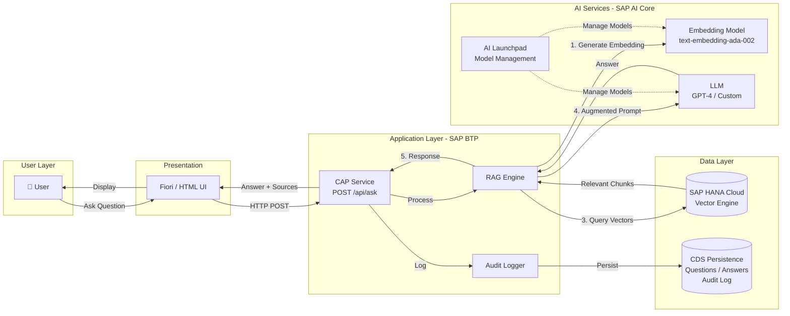
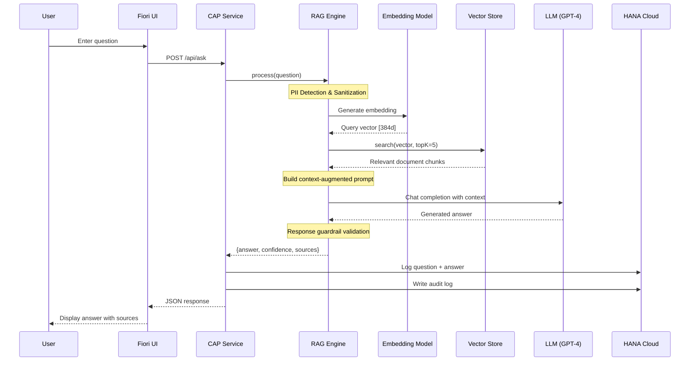

# Architecture — SAP AI Core RAG Assistant

## High-Level Architecture

## RAG Pipeline Sequence

## Component Details

| Component | Technology | Purpose |
|-----------|-----------|---------|
| UI | HTML/JS + SAP Fiori | Chat interface for end users |
| CAP Service | @sap/cds (Node.js) | API layer, routing, auth, persistence |
| RAG Engine | Custom Node.js | Orchestrates embedding → search → LLM flow |
| Vector Store | HANA Cloud Vector Engine* | Stores and searches document embeddings |
| Embedding Model | SAP AI Core (ada-002) | Converts text to vector representations |
| LLM | SAP AI Core (GPT-4) | Generates natural language answers |
| AI Launchpad | SAP AI Launchpad | Model deployment and monitoring UI |
| Database | SAP HANA Cloud | Persists questions, answers, audit logs |

*Demo uses in-memory store; production uses HANA Cloud Vector Engine.
